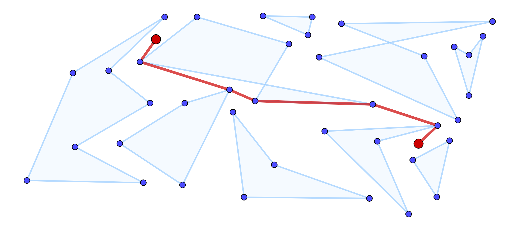

# Genetic algorithm for pathfinding
by Denis Kozub

* Non-convex polygonal obstacles on a plane
* Gene sequence with variable length
* Wang et al. greedy hybrid operator mutation for long routes
* One-point greedy hybrid operator mutation for short routes
* One-point operator crossing

# Usage

~~~c++
#include <iostream>
#include "../geometry/polygon.hpp"
#include "../geometry/point.hpp"
#include "../genetic_algorithm/genetic_algo.hpp"
#include "../genetic_data/map_data.hpp"
using namespace std;

int main()
{
    try {
        Polygon p1({ { 1, 0 }, { 2, 0 }, { 2, 4 }, { 1, 4 }, { 1, 0 } }),
                p2({ { 3, 2.5 }, { 3, 4 }, { 5, 4 }, { 5, 2.5 }, { 3, 2.5 } }),
                p3({ { 6, 0 }, { 7, 0 }, { 7, 4 }, { 6, 4 }, { 6, 0 } }),
                p4({ { 4, 5 }, { 4, 6 }, { 8, 6 }, { 8, 5 }, { 4, 5 } }),
                p5({ { 0, 5 }, { 0, 7 }, { 4, 7 }, { 4, 5 }, { 0, 5 } }),
                p6({ { 3, 7 }, { 3, 8 }, { 7, 8 }, { 7, 7 }, { 3, 7 } });
        vector<pair<Polygon, int>> obstacles({ {p1, 100}, {p2, 100}, {p3, 100}, {p4, 100}, {p5, 100}, {p6, 100} });
        Point start({ 4, 2 }), end({ 4, 10 });

        MapData data (obstacles, start, end);
        GeneticAlgo pathfinder;

        size_t population_size = 100;
        size_t epoch_number = 300;
        size_t valueless_epoch_number = 100;
        size_t preserve_best = 5;
        size_t preserve_worst = 5;
        size_t remove_duplicates = 5;
        double cross_percent = 1;
        double mutate_percent = 0.2;

        const auto& path = pathfinder.solve(&data, population_size, epoch_number, valueless_epoch_number,
            preserve_best, preserve_worst, remove_duplicates, cross_percent, mutate_percent, false);
        cout << "Path found: " << start << " -> ";
        for (const auto& point : path) {
            cout << data.pts[point] << " -> ";
        }
        cout << end << endl;
    }
    catch (std::exception& e) {
        std::cerr << typeid(e).name() << ": " << e.what() << std::endl;
    }

    return 0;
}
~~~
Result:  
Path found: ( 4, 2 ) -> ( 3, 2.5 ) -> ( 2, 4 ) -> ( 0, 5 ) -> ( 0, 7 ) -> ( 4, 10 )

# Documentation

### 1. Data interface class

~~~c++
vitrual size_t get_range() = 0;
~~~
Return maximum value to be coded (number of coded elements).

~~~c++
virtual double fitness(const std::vector<size_t>&) = 0;
~~~
Return __fitness value__ of a gene.

### 2. Gene class - work with genes of variable length
~~~c++
Gene(const Data*);
~~~
Pointer to __Data class__ should define __fitness function__ for a particular routing task.

~~~c++
void init();
~~~
Randomly initialize a gene with values in range (from _Data::get_range()_).

~~~c++
void update_chance(double average);
~~~
Update __chance value__ for proportional selection according to average __fitness value__ of whole population.

~~~c++
bool selected();
~~~
Proportional selection: according to __chance value__ check if gene is selected for crossing / mutating.  
If __chance value__ >= 1 gene is selected and __chance value__ is decreased by 1.

~~~c++
bool survived() const;
~~~
Proportional selection: according to __chance value__ check if gene escaped killing attempt.  
Formula _survive_chance = chance / (chance + 1)_ is used.  
The higher __chance value__ is, more likely gene is to survive.

~~~c++
std::pair<Gene, Gene> cross(const Gene& partner);
~~~
Perform __one-point crossing__: point is chosen randomly and parents swap their genes around this point.

~~~c++
Gene mutate();
~~~
Perform either __Wang greedy hybrid operator__ (>= 6 points) or __one-point greedy hybrid operator__ (< 6 points).  
Randomly choose 2 points of a gene and perform 3 operators: inverse, insert, swap and return best mutant.  
Randomly choose 1 point of a gene and perform 3 operators: change, insert, remove and return best mutant.

### 3. Population class
~~~c++
Population(size_t population_size, const Data*);
~~~
Pointer to __Data class__ should define __fitness function__ for a particular routing task.

~~~c++
void fill();
~~~
Fill population up to max number of genes (__population_size__).

~~~c++
void update_chance();
~~~
Update __chance values__ of all genes in population for proportional selection.

~~~c++
void remove_duplicates();
~~~
Duplicate genes are ones with the same __fitness value__.

~~~c++
void cross(double cross_percent);
~~~
Perform __crossing__ on a given percent of genes.  
First _population_size * cross_percent / 8_ genes are guaranteed to be chosen as one of the parents, others are chosen randomly.

~~~c++
void mutate(double mutate_percent);
~~~
Perform __mutation__ on a given percent of genes.  
First _population_size * cross_percent / 4_ genes are guaranteed to be mutated, others are chosen randomly.

~~~c++
void select(size_t preserve_best, size_t preserve_worst);
~~~
Perform __selection__ preserving best and worst genes.  
Killing attempts will be made until there are __population_size__ number of genes in population.

### 4. GeneticAlgo class
~~~c++
std::vector<size_t> solve();
~~~
Starts genetic algorithm. Returns best gene.  
Parameters:
- const Data* data: pointer to __Data class__ should define __fitness function__ for a particular routing task.
- size_t population_size: max number of genes in population
- size_t epoch_number: max number of iterations
- size_t valueless_epoch_number: max number of iterations without improvements
- size_t preserve_best: number of best genes preserved during selection
- size_t preserve_worst: number of worst genes preserved during selection
- size_t remove_duplicates: remove duplicate genes each ...th iteration
- double cross_percent: share of genes in population crossed (from 0 to 1)
- double mutate_percent: share of genes in population mutated (from 0 to 1)
- bool report = false: whether to print info about each iteration  

Structure of the algorithm:  
~~~
1) initialize population  
2) FOR epoch_number:  
3)     selection  
4)     remove duplicates  
5)     fill population up to population_size  
6)     crossing  
7)     mutation  
8)     check if valueless_epoch_number reached  
~~~

### 5. Fitness function
Input data: a route (represented by a gene sequence) and a set of polygons on a plane.
~~~
fitness value = 0
FOR each segment of the route:
    FOR each polygon:
        IF a segment does not intersect a polygon, its length is added to fitness value
        ELSE its length is multiplied by surface parameter and added to fitness value
~~~
